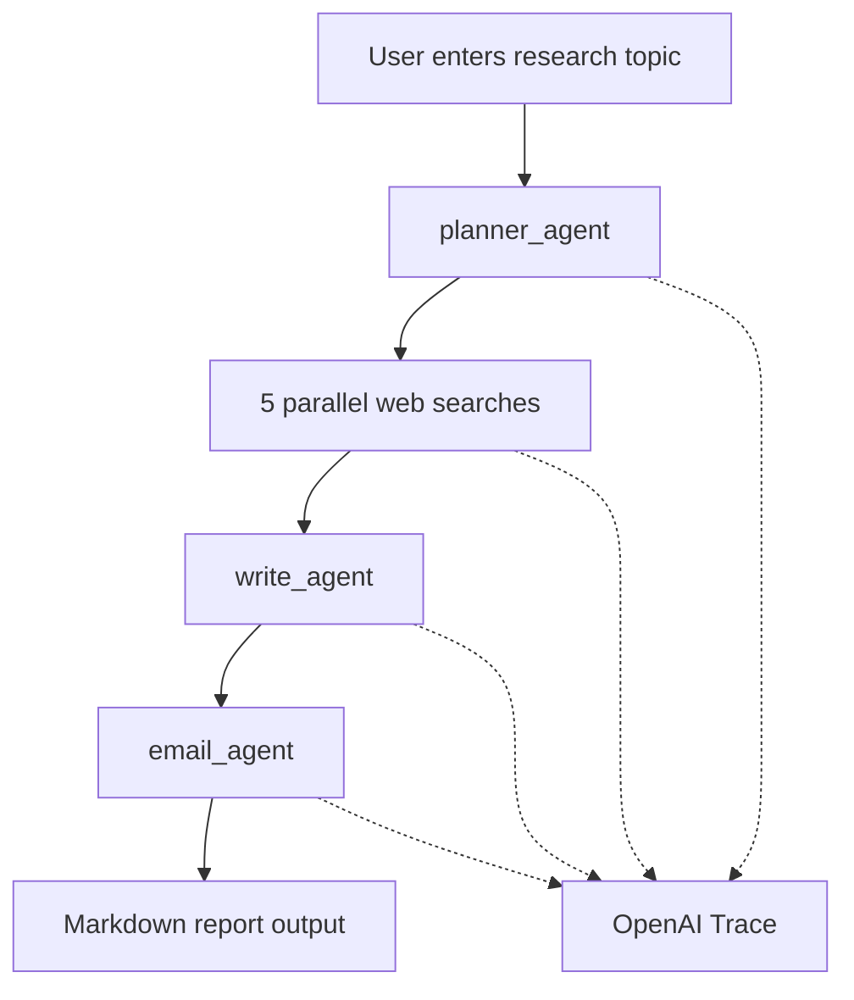

# Deep Research ✨

A multi-agent research pipeline built with the [OpenAI Agents SDK](https://openai.github.io/openai-agents-python/). Given a topic, the system plans targeted web searches, runs them in parallel, synthesizes a long-form markdown report, and optionally emails the result via Gmail.

The project uses typed Pydantic outputs so each agent returns predictable, structured data.


## Features

- **Automated research planning** — breaks a user query into five focused web search terms
- **Parallel web search** — runs searches concurrently with the hosted `WebSearchTool`
- **Long-form report generation** — produces a detailed markdown report with summary and follow-up questions
- **Email delivery** — formats the report as HTML and sends it through Gmail (SMTP over SSL)
- **OpenAI tracing** — every run records a trace ID for debugging in the OpenAI platform

## How it works

| Stage | Agent | Responsibility |
| --- | --- | --- |
| 1. Plan | `planner_agent` | Break the user query into 5 targeted web search terms |
| 2. Search | `search_agent` | Run each search with `WebSearchTool` and return concise summaries |
| 3. Write | `write_agent` | Produce a detailed markdown report with summary and follow-up questions |
| 4. Deliver | `email_agent` | Convert the report to HTML and send via Gmail SMTP |

`ResearchManager` orchestrates the full pipeline asynchronously and records an OpenAI trace for debugging.



## Project structure

```
deep_research/
├── deep_research.py      # UI entrypoint
├── research_manager.py   # Async orchestration (plan → search → write → email)
├── planner_agent.py      # Search planning + WebSearchPlan schema
├── search_agent.py       # Web search + summarization
├── write_agent.py        # Report synthesis + ReportData schema
├── email_agent.py        # HTML email formatting + Gmail SMTP delivery
└── README.md
```

## Prerequisites

- Python **3.12+**
- [OpenAI API key](https://platform.openai.com/api-keys) with access to the model used in each agent and the hosted **Web Search** tool
- A Gmail account with an [App Password](https://support.google.com/accounts/answer/185833) enabled (required only for the email step)

## Installation

### 1. Clone the repository

```bash
git clone <your-repo-url>
cd deep_research
```

### 2. Create a virtual environment

```bash
python -m venv .venv

# Windows
.venv\Scripts\activate

# macOS / Linux
source .venv/bin/activate
```

### 3. Install dependencies

```bash
pip install python-dotenv openai openai-agents
```

Or create a `requirements.txt`:

```text
python-dotenv>=1.0
openai>=1.0
openai-agents>=0.0.15
```

Then install with:

```bash
pip install -r requirements.txt
```

### 4. Configure environment variables

Create a `.env` file in the project root:

```env
OPENAI_API_KEY=sk-...
GMAIL_EMAIL=you@gmail.com
GMAIL_APP_PASSWORD=your-app-password
RECIPIENT_EMAIL=recipient@example.com
```

> **Note:** `GMAIL_APP_PASSWORD` is a 16-character App Password generated from your Google account security settings — not your regular Gmail password. Two-Factor Authentication must be enabled on the account.

> Research and report generation work without Gmail credentials. Only the final email step requires them.

## Configuration

### Change the number of searches

In `planner_agent.py`, update `HOW_MANY_SEARCHES`:

```python
HOW_MANY_SEARCHES = 5
```

### Swap models

All agents currently use `openai/gpt-oss-120b:free`. Change the `model=` argument in each agent file:

- `planner_agent.py`
- `search_agent.py`
- `write_agent.py`
- `email_agent.py`

### Search tool settings

`search_agent.py` uses `WebSearchTool(search_context_size="low")` with `tool_choice="required"`. Adjust `search_context_size` (`low`, `medium`, `high`) to trade cost for richer context.

## Architecture notes

- **Typed outputs:** `WebSearchPlan`, `WebSearchItem`, and `ReportData` are Pydantic models, so planner and writer agents return structured data instead of free-form text.
- **Concurrent search:** Searches are intended to run in parallel. Individual search failures should be skipped without stopping the pipeline.
- **Email tool:** The email agent calls a `@function_tool` wrapper around Python's `smtplib`, letting the model format HTML and choose a subject line, then sends via Gmail SMTP SSL on port 465.

## Observability

Each run generates an OpenAI trace ID that can be used to inspect agent steps, tool calls, and latency in the OpenAI platform:

```
https://platform.openai.com/traces/trace?trace_id=<trace_id>
```

## Troubleshooting

| Issue | Likely cause | Fix |
| --- | --- | --- |
| `ModuleNotFoundError: agents` | `openai-agents` not installed | `pip install openai-agents` |
| Search step fails | Missing web search access on your OpenAI account | Enable hosted web search for your API key |
| Email step fails | Missing or wrong Gmail credentials | Check `GMAIL_EMAIL`, `GMAIL_APP_PASSWORD`, `RECIPIENT_EMAIL` in `.env`; ensure App Password is used |
| Empty report | All searches failed | Check trace link; retry with a broader topic |

## License

See the LICENSE file in this repository, or contact the repository maintainer for terms of use.
