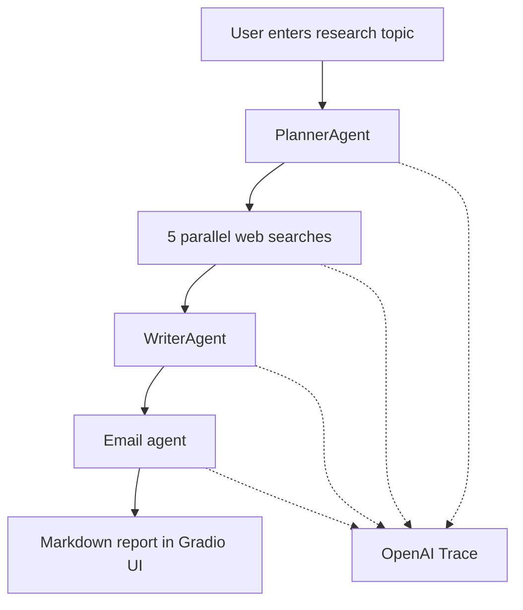

# Deep Research ✨

A multi-agent research pipeline built with the [OpenAI Agents SDK](https://openai.github.io/openai-agents-python/). Given a topic, the system plans targeted web searches, runs them in parallel, synthesizes a long-form markdown report, and optionally emails the result via SendGrid.

The project ships with a [Gradio](https://gradio.app/) UI for interactive use and uses typed Pydantic outputs so each agent returns predictable, structured data.

## Features

- **Automated research planning** — breaks a user query into five focused web search terms
- **Parallel web search** — runs searches concurrently with the hosted `WebSearchTool`
- **Long-form report generation** — produces a detailed markdown report with summary and follow-up questions
- **Email delivery** — formats the report as HTML and sends it through SendGrid
- **Live progress streaming** — status updates stream to the Gradio UI as each stage completes
- **OpenAI tracing** — every run records a trace ID for debugging in the OpenAI platform

## How it works

| Stage | Agent | Responsibility |
| --- | --- | --- |
| 1. Plan | `PlannerAgent` | Break the user query into 5 targeted web search terms |
| 2. Search | `Search agent` | Run each search with `WebSearchTool` and return concise summaries |
| 3. Write | `WriterAgent` | Produce a detailed markdown report with summary and follow-up questions |
| 4. Deliver | `Email agent` | Convert the report to HTML and send via SendGrid |

`ResearchManager` orchestrates the full pipeline asynchronously, streams status updates to the UI, and records an OpenAI trace for debugging.



## Project structure

```
deep_research/
├── deep_research.py      # Gradio UI entrypoint
├── research_manager.py   # Async orchestration (plan → search → write → email)
├── planner_agent.py      # Search planning + WebSearchPlan schema
├── search_agent.py       # Web search + summarization
├── writer_agent.py       # Report synthesis + ReportData schema
├── email_agent.py        # HTML email formatting + SendGrid delivery
└── README.md
```

## Prerequisites

- Python **3.12+**
- [OpenAI API key](https://platform.openai.com/api-keys) with access to `gpt-4o-mini` and the hosted **Web Search** tool
- [SendGrid](https://sendgrid.com/) account with a verified sender (required only for the email step)

## Installation

### 1. Clone the repository

```bash
git clone <your-gitlab-repo-url>
cd deep_research
```

### 2. Create a virtual environment

```bash
python -m venv .venv

# Windows
.venv\Scripts\activate

# macOS / Linux
source .venv/bin/activate
```

### 3. Install dependencies

```bash
pip install gradio python-dotenv sendgrid openai openai-agents
```

Or create a `requirements.txt` in this directory:

```text
gradio>=5.0
python-dotenv>=1.0
sendgrid>=6.0
openai>=1.0
openai-agents>=0.0.15
```

Then install with:

```bash
pip install -r requirements.txt
```

### 4. Configure environment variables

Create a `.env` file in the project root. `deep_research.py` loads it via `load_dotenv(override=True)`.

```env
OPENAI_API_KEY=sk-...
SENDGRID_API_KEY=SG....
```

### 5. Customize email recipients

Edit `email_agent.py` and set your verified SendGrid sender and recipient:

```python
from_email = Email("you@yourverifieddomain.com")
to_email = To("recipient@example.com")
```

> **Note:** Research and report generation work without SendGrid. Only the final email step requires a valid API key and verified sender.

## Running locally

```bash
python deep_research.py
```

The Gradio UI opens in your browser at `http://127.0.0.1:7860`.

### Usage

1. Enter a research topic in the text box.
2. Click **Run** (or press Enter).
3. Watch streaming status updates: trace link → searches planned → searches complete → report written → email sent.
4. The final markdown report appears in the UI.

## Configuration

### Change the number of searches

In `planner_agent.py`, update `HOW_MANY_SEARCHES`:

```python
HOW_MANY_SEARCHES = 5
```

### Swap models

All agents default to `gpt-4o-mini`. Change the `model=` argument in each agent file:

- `planner_agent.py`
- `search_agent.py`
- `writer_agent.py`
- `email_agent.py`

### Search tool settings

`search_agent.py` uses `WebSearchTool(search_context_size="low")` with `tool_choice="required"`. Adjust `search_context_size` (`low`, `medium`, `high`) to trade cost for richer context.

## Architecture notes

- **Typed outputs:** `WebSearchPlan`, `WebSearchItem`, and `ReportData` are Pydantic models, so planner and writer agents return structured data instead of free-form text.
- **Concurrent search:** Searches run in parallel via `asyncio.create_task` and `asyncio.as_completed`. Individual search failures are skipped without stopping the pipeline.
- **Email tool:** The email agent calls a `@function_tool` wrapper around the SendGrid API, letting the model format HTML and choose a subject line.

## Observability

Each run generates an OpenAI trace ID. The manager prints and yields a link:

```
https://platform.openai.com/traces/trace?trace_id=<trace_id>
```

Use this to inspect agent steps, tool calls, and latency in the OpenAI platform.

## API cost

This flow makes multiple model calls plus web searches. Monitor usage on the [OpenAI usage dashboard](https://platform.openai.com/usage).

## Troubleshooting

| Issue | Likely cause | Fix |
| --- | --- | --- |
| `ModuleNotFoundError: agents` | `openai-agents` not installed | `pip install openai-agents` |
| Search step fails | Missing web search access on your OpenAI account | Enable hosted web search for your API key |
| Email step fails | Invalid SendGrid key or unverified sender | Verify sender in SendGrid; check `SENDGRID_API_KEY` |
| Empty report | All searches failed | Check trace link; retry with a broader topic |

## License

See the LICENSE file in this repository, or contact the repository maintainer for terms of use.
